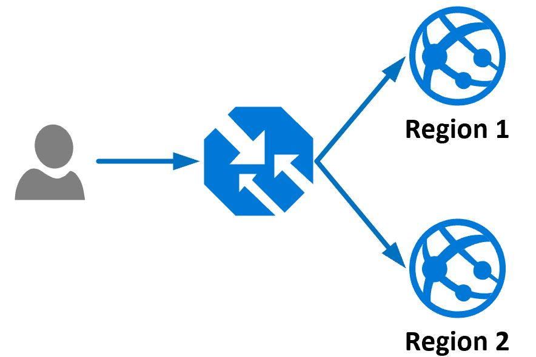

# chaostoolkit-azure-demo
A simple demonstration of testing resiliency using Chaos Engineering.

# Scenarios #

## Web App Resiliency Demo ##
The Web App demonstration makes use of [Traffic Manager](https://azure.microsoft.com/en-us/services/traffic-manager/#overview) to provide resiliency against a regional failure.

The high level traffic flow can be seen in the image below:

A user requests the demo website which is protected by Traffic Manager, based on the routing profile configured the User is directed to the best WebApp instance for them in either Region 1 or Region 2.  In the event that one of the Web Apps is offline the user is automatically routed to the other region.

### Environment Setup via supplied container ###
1. Log in to [Visual Studio Codespaces](https://online.visualstudio.com/login)
2. If this is your first time you will need to create a plan: *** NEED INSTRUCTIONS *** 
3. Click *Create Codespace*
4. Name your codespace `Azure Chaos Demo`
5. For *Git Repository* enter `https://github.com/ianalderman/chaostoolkit-azure-demo`
6. For *Instance Type* select *Basic(Linux): 2 cores, 4GB RAM*
7. Click *Create*
8. Your codespace will now need to build the container for use in this demo
9. Once your codepsace has loaded from the menu icon in the top left of the screen select *Terminal -> New Terminal*

1. Execute the following command:
`
environmentSetup/buildWebAppDemo.sh
`
1. When the script is complete make note of the Traffic Manager address provided at the end of the script - you will need this for configuring your experiments.
1. Next you will need to configure the authentication profile for your Chaos Experiments.  To do this execute the following command: `environmentSetup/configureCredentials.sh`
1. To perform your experiments see the *Configure WebApp Experiments* section

### Configure WebApp Experiments ###
Before we can run our experiments we need to update our WebApp experiments with the unique name assigned to our website for this demo.  In the *Environment Setup* stage you should have made note of your traffic manager address.

1. Change to the *experiments/webApps* directory.  In the contianer: `cd experiments/webApps`
2. Execute the *configureExperiments.sh* script.  In the container: `./configureExperiments.sh`
3. At the prompt enter the Traffic manager address from the setup steps.  **N.B DO NOT INCLUDE THE HTTP://**, e.g., for **http://example.trafficmanger.net** enter `example.trafficmanager.net`

### Run Experiments ###
These commands should be executed from the *experiments/webApps* directory (you should still be here from previous steps)

1. We need to switch to our testing environment run the following command: `source /home/vscode/venvs/chaosk/bin/activate`
2. Now we run our first experiment: `chaos run Experiment1.json`

